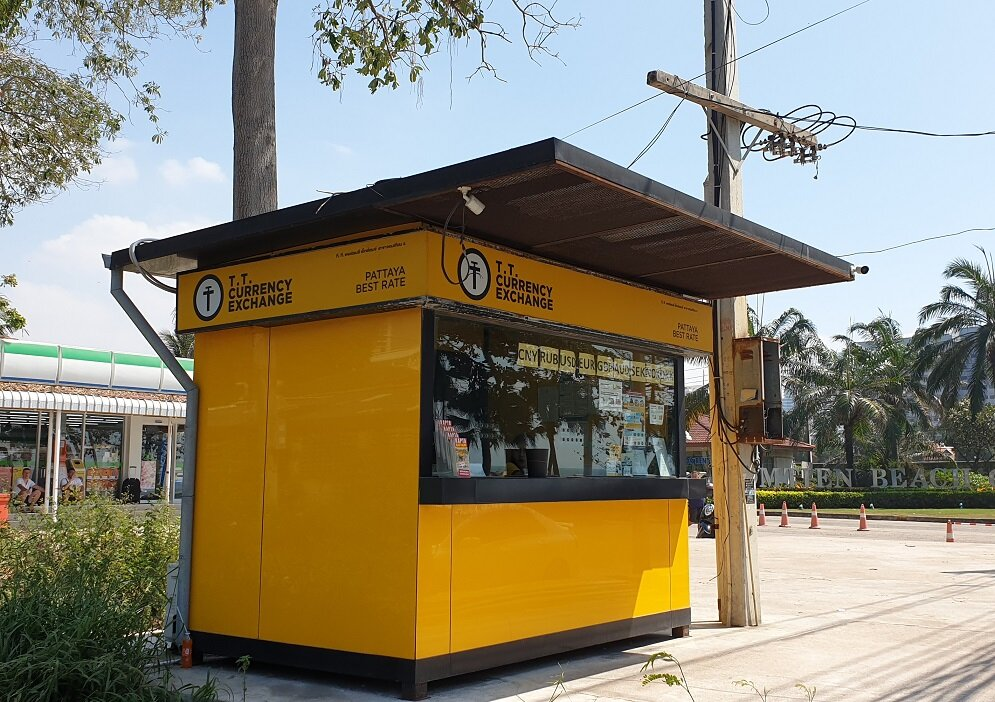
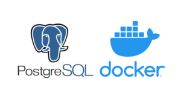

# Проверь курс валюты перед отпуском!

# Сервис Обмен валюты
## Используемые технологии

- Spring Boot 2.7
- Maven 3
- Lombok
- Mapstruct
- Liquibase
- PostgreSQL

## Требования

### JDK 17

Проект использует синтаксис Java 17. Для локального запуска вам потребуется
установленный JDK 17.

### Docker
Для запуска проекта вам потребуется установленный и запущенный Docker.
Для запуска БД(PostgreSQL) требется запустить соответствующий сервис в Docker.

### Подключение к интернету

Подключение к интернету для получения курсов валют

## Полезные команды

### Запуск контейнера с базой данных

```bash
docker run -p 5432:5432 --name postgres -e POSTGRES_PASSWORD=postgres -d postgres
```

Пользователь для подключения к контейнеру `postgres`.

### IntelliJ IDEA

Запустите main метод класса Application

### Запросы API

Получить информацию о курсах валют

```bash
OkHttpClient client = new OkHttpClient().newBuilder()
  .build();
MediaType mediaType = MediaType.parse("text/plain");
RequestBody body = RequestBody.create(mediaType, "");
Request request = new Request.Builder()
  .url("http://localhost:8080/api/currency")
  .method("GET", body)
  .build();
Response response = client.newCall(request).execute();
```

Получение Валюты по id

```bash
curl --request GET \
  --url http://localhost:8080/api/currency/1333
```

Получение Валюты  по числовому коду

```bash
OkHttpClient client = new OkHttpClient().newBuilder()
  .build();
MediaType mediaType = MediaType.parse("text/plain");
RequestBody body = RequestBody.create(mediaType, "");
Request request = new Request.Builder()
  .url("http://localhost:8080/api/currency/convert?currencyCode=840")
  .method("GET", body)
  .build();
Response response = client.newCall(request).execute();
```


## Database:
- Postgresql



